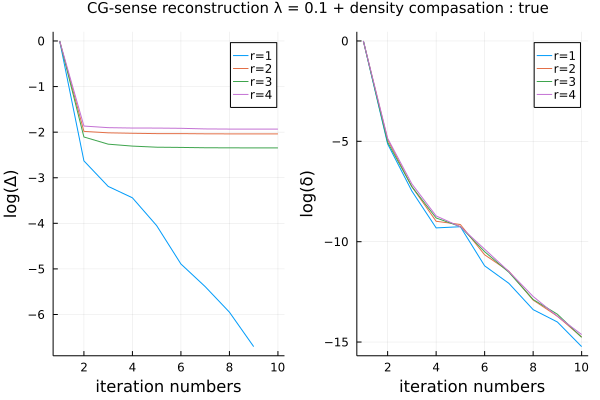
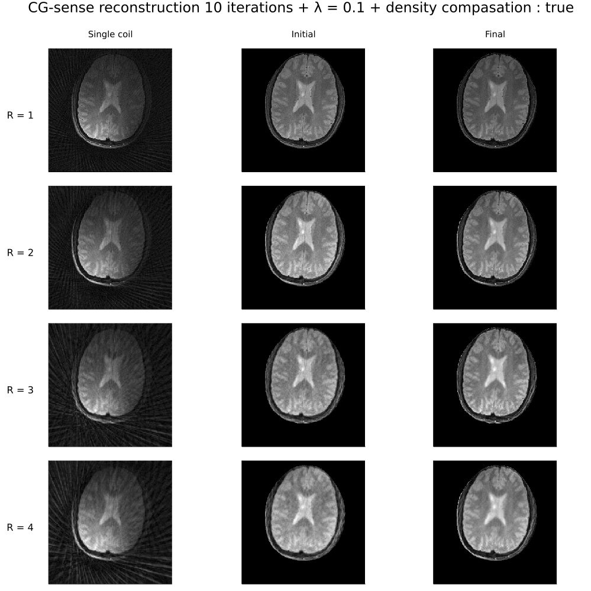

# ISMRM 2019 Reproducible research study group challenge
HTML pages : https://atrotier.github.io/ISMRM_RRSG_JULIA/Julia_CG-sense.html generated with the [static-export-template workflow for Pluto](https://github.com/JuliaPluto/static-export-template)

### Description

Implementation of [ISMRM Reproducibility Challenges](https://ismrm.github.io/rrsg/) using the MRI reconstruction framework [MRIReco.jl](https://travis-ci.org/github/MagneticResonanceImaging/MRIReco.jl). 

This implentation uses low-level function of multiple packages and implement the conjugate gradient algorithm in a plain text function. The implementation is done in a [Pluto Notebook](https://github.com/fonsp/Pluto.jl).

### Challenge 1

Goal of [challenge 1](https://blog.ismrm.org/2019/04/02/ismrm-reproducible-research-study-group-2019-reproduce-a-seminal-paper-initiative/) is to reproduce the results from the paper [1]. 

#### Results
The following figures show the reconstruction results generated with **Julia_CG-sense.jl**.
In the left figure, Δ denotes the NRMSE between the iterates and the reference reconstruction.
In the right figure, δ denotes the ratio of the cost function at each iteration to the initial cost function.

##### Figure 4 : Error results after 10 iteration

##### Figure 5 : Brain reconstruction after 10 iterations

### References

[1] Pruessmann, K. P.; Weiger, M.; Boernert, P. and Boesiger, P. Advances in sensitivity encoding with arbitrary k-space trajectories. Magn Reson Med 46: 638-651 (2001)

### Contact

Aurélien Trotier [aurelien . trotier (at) rmsb.u-bordeaux . fr]

